# 2025 年高教社杯全国大学生数学建模竞赛 B 题解题文档

## 碳化硅外延层厚度的确定

> **进度说明**：本文档按问题分节编写，求解数值在对应问题完成后回填。
> 当前进度：问题 1 的数学模型、问题 2 的算法与计算、问题 3 的多光束分析均已完成。

---

## 结果一览

| 问题 | 内容 | 主要结果 |
| :--- | :--- | :--- |
| 问题 1 | 双光束干涉模型（光程差、干涉光强、厚度公式、包络反演折射率） | 式 (1)–(24) |
| 问题 2 | 碳化硅外延层厚度 | 附件 1：7.564 ± 0.1135 μm；附件 2：7.214 ± 0.2000 μm |
| 问题 3 | 硅多光束干涉分析与厚度 | 附件 3：3.661 ± 0.1572 μm；附件 4：3.413 ± 0.1962 μm（多光束模型） |
| 问题 3 | 碳化硅多光束复核 | 折射率与厚度基本不变（差 < 0.001 μm），无需修正 |
| 最终合并 | 两组入射角数据逆方差加权 | 碳化硅 7.479 μm，95% CI [7.286, 7.672]；硅 3.564 μm，95% CI [3.324, 3.805] |

---

## 一、题目背景与附件说明

碳化硅（SiC）是第三代半导体材料，其外延层厚度是外延材料的关键参数。红外干涉法利用外延层与衬底折射率不同所产生干涉条纹，由红外光谱的波长（波数）、外延层折射率和入射角等参数反推外延层厚度。

附件数据说明（题目附件说明）：

| 附件 | 材料 | 入射角 | 内容 |
| :--- | :--- | :--- | :--- |
| 附件1.xlsx | 碳化硅晶圆片 | 10° | 波数（cm⁻¹）与反射率（%）光谱 |
| 附件2.xlsx | 碳化硅晶圆片（同一片） | 15° | 波数（cm⁻¹）与反射率（%）光谱 |
| 附件3.xlsx | 硅晶圆片 | 10° | 波数（cm⁻¹）与反射率（%）光谱 |
| 附件4.xlsx | 硅晶圆片（同一片） | 15° | 波数（cm⁻¹）与反射率（%）光谱 |

每个附件共 7469 个采样点，波数范围约 399.7–4000.1 cm⁻¹。

---

## 二、问题 1：外延层厚度确定的数学模型（双光束干涉）

本节从红外干涉测厚的物理原理出发，依次建立光程差、干涉光强、厚度计算公式与折射率反演四部分模型，最终形成“由实测反射光谱确定外延层厚度”的完整数学模型。

### 2.1 模型假设

1. 外延层上下表面为理想光滑、互相平行的平面，外延层厚度 $d$ 处处均匀；
2. 入射光为单色平行光，仅考虑空气—外延层界面一次反射、外延层—衬底界面一次反射及相应透射形成的两束光（双光束干涉），忽略多次反射与透射；
3. 界面无吸收，透射率与反射率满足能量守恒：$t_{01}=1-r_{01}$，$t_{10}=1-r_{10}$；
4. 空气折射率 $n_0$ 已知（取 $n_0=1$）；外延层折射率 $n$、衬底折射率 $n_s$ 与波数（或波长）有关，即 $n=n(\omega)$，$n_s=n_s(\omega)$；
5. 上、下表面反射性质不同，反射光之间存在 $\pi$ 的相位突变（半波损失），计入光程差 $\lambda/2$；
6. 外延层无吸收损耗，干涉光强线性叠加。

### 2.2 符号说明

| 符号 | 含义 | 单位 |
| :--- | :--- | :--- |
| $d$ | 外延层厚度 | μm |
| $\omega$ | 波数，$\omega=1/\lambda$ | cm⁻¹ |
| $\lambda$ | 真空中波长 | cm |
| $\theta_1$ | 入射角（空气侧） | ° |
| $\theta_2$ | 折射角（外延层内） | ° |
| $n_0$ | 空气折射率 | 无量纲 |
| $n$ | 外延层折射率 | 无量纲 |
| $n_s$ | 衬底折射率 | 无量纲 |
| $\Delta$ | 两束反射光的光程差 | cm |
| $\delta$ | 相位差，$\delta=2\pi\Delta/\lambda$ | rad |
| $I_1,I_2$ | 两束反射光的光强 | 无量纲 |
| $I$ | 叠加后的干涉光强 | 无量纲 |
| $R$ | 反射率 | 无量纲（%） |
| $R_{\max},R_{\min}$ | 干涉光谱的包络最大、最小值 | 无量纲 |
| $r_{01},r_{10}$ | 空气—外延层界面能量反射率 | 无量纲 |
| $r_{1s}$ | 外延层—衬底界面能量反射率 | 无量纲 |
| $t_{01},t_{10}$ | 界面能量透射率 | 无量纲 |
| $N$ | 两波峰（或波谷）之间的条纹间隔数 | 无量纲 |
| $m$ | 干涉级次 | 无量纲 |

### 2.3 光程差

薄膜干涉的几何关系如题目图 1 所示：入射光以入射角 $\theta_1$ 到达空气—外延层界面 A 点，一部分直接反射回空气（反射光 1），另一部分以折射角 $\theta_2$ 进入外延层；透射光到达外延层—衬底界面 B 点后反射，再经外延层—空气界面 C 点折射出空气（反射光 2）。两束反射光相干叠加产生干涉条纹。两束反射光的光程差定义为第二束光与第一束光所走路程的光程之差。

设外延层内折射角为 $\theta_2$，由几何关系

$$AB=BC=\frac{d}{\cos\theta_2},$$

$$AC=2AB\cdot\sin\theta_2=2d\tan\theta_2,$$

$$AN=AC\cdot\sin\theta_1=2d\tan\theta_2\cdot\sin\theta_1.$$

于是光程差

$$\Delta=n(AB+BC)-n_0AN=2nd\cos\theta_2=2d\sqrt{n^2-n_0^2\sin^2\theta_1}, \tag{1}$$

其中第一个等号是光程差的定义，后两个等号由折射定律 $n_0\sin\theta_1=n\sin\theta_2$ 得到。

由于上、下两个界面的反射性质不同，反射光之间存在 $\pi$ 相位突变（半波损失），等效光程差应再增加半个波长：

$$\Delta=2d\sqrt{n^2-n_0^2\sin^2\theta_1}+\frac{\lambda}{2}. \tag{2}$$

对于厚度计算公式的推导，$\lambda/2$ 项对两束光同等地移动干涉级次，相减后抵消，因此是否计入并不影响厚度公式（见 2.4 节）。

### 2.4 双光束干涉光强模型

设两束反射光光强分别为 $I_1$、$I_2$，波长相同，相位差

$$\delta=\frac{2\pi\Delta}{\lambda}. \tag{3}$$

两束光相干叠加，干涉光强为（双光束干涉的数学模型）

$$I=I_1+I_2+2\sqrt{I_1I_2}\cos\delta. \tag{4}$$

当 $I_1\approx I_2$ 时，式 (17) 简化为

$$I=4I_1\cos^2\frac{\pi\Delta}{\lambda}. \tag{5}$$

由式 (5)：当 $\Delta=m\lambda$ 时，$\cos^2(m\pi)=1$，光强达到最大，出现亮条纹；当 $\Delta=\left(m+\frac12\right)\lambda$ 时，光强达到最小，出现暗条纹。因此干涉光谱呈现明暗相间的周期条纹，条纹位置由外延层厚度 $d$ 与折射率决定，这是由光谱确定厚度的物理基础。

### 2.5 外延层厚度的计算公式

#### 2.5.1 常数折射率情形

取两个相邻的亮条纹波长 $\lambda_1>\lambda_2$，满足

$$\Delta=m\lambda_1,\qquad \Delta=(m+1)\lambda_2, \tag{6}$$

其中 $m$ 为干涉级次。由式 (2)、(6) 得

$$2d\sqrt{n^2-n_0^2\sin^2\theta_1}=\left(m-\frac12\right)\lambda_1,\qquad
2d\sqrt{n^2-n_0^2\sin^2\theta_1}=\left(m+\frac12\right)\lambda_2,$$

即

$$\frac{2d\sqrt{n^2-n_0^2\sin^2\theta_1}}{\lambda_1}=m-\frac12,\qquad
\frac{2d\sqrt{n^2-n_0^2\sin^2\theta_1}}{\lambda_2}=m+\frac12.$$

两式相减得

$$d=\left(2\sqrt{n^2-n_0^2\sin^2\theta_1}\right)^{-1}
\left(\frac{1}{\lambda_2}-\frac{1}{\lambda_1}\right)^{-1}. \tag{7}$$

若两个亮条纹之间间隔 $N$ 个条纹（$N$ 为条纹间隔数，可为整数；若为波峰与波谷之间则为半整数），即

$$\Delta=m\lambda_1,\qquad \Delta=(m+N)\lambda_2, \tag{8}$$

则式 (7) 推广为

$$d=\frac{N}{2\sqrt{n^2-n_0^2\sin^2\theta_1}}\cdot
\left(\frac{1}{\lambda_2}-\frac{1}{\lambda_1}\right)^{-1}. \tag{9}$$

式 (9) 是常数折射率情形下薄膜厚度的常用计算公式。取多个条纹间隔计算并求平均，可减小参数误差对结果的影响。

改用波数 $\omega_1=1/\lambda_1$、$\omega_2=1/\lambda_2$ 表示（波峰坐标），式 (9) 改写为

$$d=\frac{N}{2\sqrt{n^2-n_0^2\sin^2\theta_1}}\cdot\frac{1}{\omega_2-\omega_1}. \tag{10}$$

#### 2.5.2 非常数折射率情形（本题主线公式）

外延层折射率 $n$ 随波数变化，式 (10) 是在折射率为常数时得到的，需作修正。设 $\Delta(\omega)=2d\sqrt{n^2(\omega)-n_0^2\sin^2\theta_1}+\dfrac{1}{2\omega}$，其中 $n(\omega)$ 为波数 $\omega$ 处的外延层折射率。干涉极大条件为

$$\omega_1\Delta(\omega_1)=m,\qquad \omega_2\Delta(\omega_2)=m+N.$$

两式相减，得

$$d=\frac{N}{2\left[\omega_2\sqrt{n^2(\omega_2)-n_0^2\sin^2\theta_1}-
\omega_1\sqrt{n^2(\omega_1)-n_0^2\sin^2\theta_1}\right]}. \tag{11}$$

式 (11) 是式 (10) 的推广：当 $n$ 为常数时，$\omega_2\sqrt{n^2-n_0^2\sin^2\theta_1}-\omega_1\sqrt{n^2-n_0^2\sin^2\theta_1}=(\omega_2-\omega_1)\sqrt{n^2-n_0^2\sin^2\theta_1}$，式 (11) 退化为式 (10)。

### 2.6 折射率模型（反射率反演）

式 (11) 中折射率 $n(\omega)$ 未知。为确定 $n(\omega)$ 与衬底折射率 $n_s(\omega)$，需要建立反射率模型。

#### 2.6.1 界面反射率

对斜入射情形，能量反射率由 s 偏振与 p 偏振平均得到：

$$R=\frac{1}{2}\left(r_s^2+r_p^2\right), \tag{12}$$

其中振幅反射系数

$$r_s=\frac{n_0\cos\theta_1-n\cos\theta_2}{n_0\cos\theta_1+n\cos\theta_2}, \tag{13}$$

$$r_p=\frac{n\cos\theta_1-n_0\cos\theta_2}{n\cos\theta_1+n_0\cos\theta_2}. \tag{14}$$

由式 (12)–(14) 可计算 A 点的反射率 $r_{01}$ 与透射率 $t_{01}=1-r_{01}$；B 点（外延层—衬底界面）反射率记为 $r_{1s}$，计算方式与 $r_{01}$ 相同；C 点反射率记为 $r_{10}$、透射率 $t_{10}=1-r_{10}$。于是两束反射光的光强为

$$I_1=r_{01},\qquad I_2=t_{01}r_{1s}t_{10}. \tag{15}$$

#### 2.6.2 正入射简化

由式 (12)–(14) 可知，入射角在 $0°$–$40°$ 范围内能量反射比几乎不随入射角变化；本题实测入射角为 10° 与 15°，故可按正入射（$\theta_1=0$）简化反射率计算，误差很小。取 $n_0=1$、$\theta_1=0$，式 (13)、(14) 简化为

$$r_{01}=r_{10}=\left(\frac{n_0-n}{n_0+n}\right)^2,\qquad
r_{1s}=\left(\frac{n_s-n}{n_s+n}\right)^2. \tag{16}$$

由式 (15)、(16) 得

$$I_1=r_{01}=r_{10}=\left(\frac{n_0-n}{n_0+n}\right)^2, \tag{17}$$

$$I_2=t_{01}r_{1s}t_{10}=(1-I_1)^2\left(\frac{n_s-n}{n_s+n}\right)^2. \tag{18}$$

#### 2.6.3 由包络反演折射率

由双光束干涉模型式 (4)，干涉光谱的极大、极小值为

$$R_{\max}=I_1+I_2+2\sqrt{I_1I_2}=\left(\sqrt{I_1}+\sqrt{I_2}\right)^2, \tag{19}$$

$$R_{\min}=I_1+I_2-2\sqrt{I_1I_2}=\left(\sqrt{I_1}-\sqrt{I_2}\right)^2. \tag{20}$$

记 $A=\sqrt{I_1}$，$B=\sqrt{I_2}$，$C=\sqrt{R_{\max}}$，$D=\sqrt{R_{\min}}$，则

$$C=A+B,\qquad D=A-B, \tag{21}$$

$$A=\frac{C+D}{2},\qquad B=\frac{C-D}{2}. \tag{22}$$

由式 (17) 反解出外延层折射率

$$n=\frac{1+A}{1-A}, \tag{23}$$

由式 (18) 反解出衬底折射率

$$n_s=\frac{n\left(1-A^2-B\right)}{1-A^2+B}. \tag{24}$$

其中 $R_{\max}(\omega)$、$R_{\min}(\omega)$ 是实测干涉光谱的上下包络，由光谱的极大值点、极小值点分别连接（插值）得到；其具体提取算法（滤波、极值点定位、包络插值）属于问题 2 的算法部分，本节只将其作为模型的已知输入。

即：**只要从实测光谱中提取包络 $R_{\max}(\omega)$、$R_{\min}(\omega)$，即可由式 (22)–(24) 反演出外延层与衬底的折射率 $n(\omega)$、$n_s(\omega)$，再代入式 (11) 计算外延层厚度 $d$**。该数据包络反演法不受材料限制，但易受噪声干扰，因此问题 2 的算法中先对光谱滤波再提取包络。

### 2.7 模型的说明

问题 1 只要求建立模型，不涉及实际数据的求解。本文建立的模型给出了外延层厚度的确定式：

1. 式 (1)、(2) 给出光程差 $\Delta$ 与厚度 $d$、折射率 $n$、入射角 $\theta_1$ 的关系；
2. 式 (4)（及简化式 (5)）给出双光束干涉光强与 $\Delta$ 的关系，即干涉条纹的位置（波峰/波谷坐标）由厚度与折射率共同决定；
3. 式 (11) 给出由两个条纹坐标 $\omega_1$、$\omega_2$、条纹间隔数 $N$ 及对应折射率 $n(\omega_1)$、$n(\omega_2)$ 计算厚度 $d$ 的公式（常数折射率时为式 (9)/(10)）；
4. 式 (12)–(24) 给出由实测光谱包络 $R_{\max}(\omega)$、$R_{\min}(\omega)$ 反演外延层折射率 $n(\omega)$ 与衬底折射率 $n_s(\omega)$ 的方法，使式 (11) 可直接用于实测光谱。

因此，问题 1 的数学模型是“实测反射光谱 → 折射率 → 厚度”的完整链条，其结构如下：

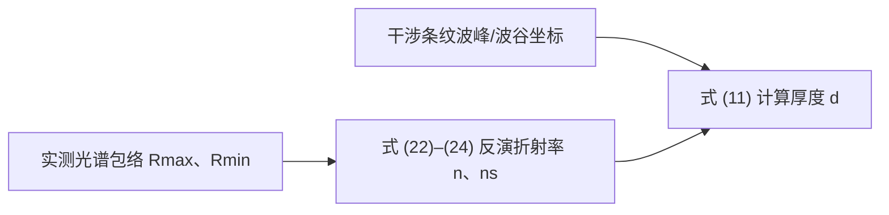

利用该模型处理附件数据的具体算法与数值结果属于问题 2，本文档将在问题 2 完成后回填。

---

## 三、问题 2：SiC 外延层厚度的计算算法与结果

### 3.1 算法总体流程

根据问题 1 建立的数学模型，问题 2 的算法流程如下：

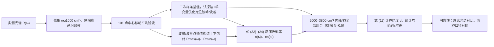

### 3.2 数据预处理

画出附件 1、附件 2 的反射光谱后可见：在低波数段（约 400–1000 cm⁻¹）存在一个“凸”形的包，工程上称为**剩余射线带（reststrahlen band）**，其数值并不完全是入射光的反射结果（附件 2 在 600–1000 cm⁻¹ 的反射率甚至超过 100%），该段数据不具周期性，若用于计算反而降低厚度精度。因此：

- 计算时**只考虑波数 ≥ 1000 cm⁻¹ 的数据**；
- 厚度计算进一步选用条纹较为稳定的区间 **2000–3800 cm⁻¹**；
- 附件 1 入射角 $\theta_1=10°$，附件 2 入射角 $\theta_1=15°$。

附件 1、2 的原始反射光谱见图 2，低波数段的“凸包”即剩余射线带，不参与计算。

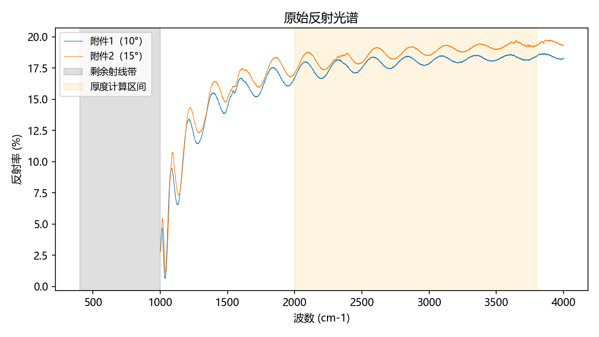

### 3.3 滤波（101 点中心移动平均）

干涉光谱中叠加有测量噪声，直接定位波峰/波谷会引入较大误差，因此先滤波。采用 **101 点中心移动平均**：

$$\bar{y}_i=\frac{1}{101}\sum_{k=-50}^{50}y_{i+k}, \tag{25}$$

其中 $y_i$ 为原始反射率，$\bar{y}_i$ 为滤波后的反射率。边界处可用较短的对称窗口或边缘补齐处理。滤波后的曲线显著平滑，同时保持干涉条纹的周期结构（图 3）。

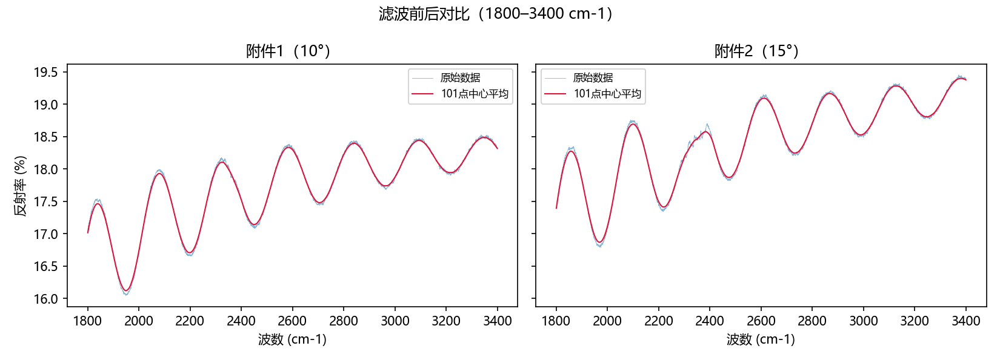

### 3.4 波峰/波谷坐标的定位

滤波后数据仍是离散点，为精确求极值点位置，采用以下三步：

1. **三次样条插值**：对滤波后的数据作三次样条插值，得到具有连续一、二阶导数的光滑曲线；
2. **试探法找初始区间**：沿波数轴扫描，找到满足“低—高—低”（对应极大值）或“高—低—高”（对应极小值）的三连点，作为包含极值点的初始小区间；
3. **单变量优化**：在每个初始小区间上使用单变量优化方法（如 Brent 法）求样条曲线的极值点。由于三次样条在每个小区间内只有一个单峰（或单谷），所得即为该小区间上的全局极值点，对应波峰（或波谷）坐标 $\omega_i$。

为避免残余噪声在样条上产生幅度极小的伪极值，要求候选极值点在滤波数据上的显著性（prominence）不低于 0.05% 反射率；实际干涉条纹的峰谷幅度约为 0.4%–1.4%，而噪声伪极值小于 0.01%，二者可清晰分离。定位得到的 2000–3800 cm⁻¹ 内全部极值点如下表（峰谷严格交替）。

| 序号 | 附件 1 坐标（cm⁻¹） | 类型 | 附件 2 坐标（cm⁻¹） | 类型 |
| :---: | :---: | :---: | :---: | :---: |
| 1 | 2079.28 | 波峰 | 2099.02 | 波峰 |
| 2 | 2197.52 | 波谷 | 2218.72 | 波谷 |
| 3 | 2325.73 | 波峰 | 2384.83 | 波峰 |
| 4 | 2449.94 | 波谷 | 2474.75 | 波谷 |
| 5 | 2584.14 | 波峰 | 2612.93 | 波峰 |
| 6 | 2704.61 | 波谷 | 2731.10 | 波谷 |
| 7 | 2841.64 | 波峰 | 2867.31 | 波峰 |
| 8 | 2960.91 | 波谷 | 2988.65 | 波谷 |
| 9 | 3093.42 | 波峰 | 3124.89 | 波峰 |
| 10 | 3217.81 | 波谷 | 3246.73 | 波谷 |
| 11 | 3350.70 | 波峰 | 3381.14 | 波峰 |
| 12 | 3466.90 | 波谷 | 3496.86 | 波谷 |
| 13 | 3609.08 | 波峰 | 3655.60 | 波峰 |
| 14 | 3721.00 | 波谷 | 3765.34 | 波谷 |

### 3.5 包络与折射率反演

**包络提取**：将滤波后光谱的全部波峰点连接插值，得到上包络 $R_{\max}(\omega)$；将全部波谷点连接插值，得到下包络 $R_{\min}(\omega)$（本算法采用三次样条插值构造包络）。包络反映了干涉光谱的极大、极小值随波数的缓慢变化。

**折射率反演**：按问题 1 的式 (22)–(24)（此处为方便阅读重列，公式编号见问题 1）：

$$A=\frac{\sqrt{R_{\max}}+\sqrt{R_{\min}}}{2},\qquad
B=\frac{\sqrt{R_{\max}}-\sqrt{R_{\min}}}{2},$$

$$n(\omega)=\frac{1+A}{1-A},$$

$$n_s(\omega)=\frac{n\left(1-A^2-B\right)}{1-A^2+B}.$$

即可得到每个波数处的外延层折射率 $n(\omega)$ 与衬底折射率 $n_s(\omega)$。式 (22)–(24) 按正入射（$\theta_1=0$）推导；由式 (12)–(14) 可知入射角在 $0°$–$40°$ 内能量反射比几乎不变，附件 1、2 的入射角为 10°、15°，由此带来的误差很小。

图 4 给出滤波数据与上下包络，图 5 给出反演的折射率曲线。

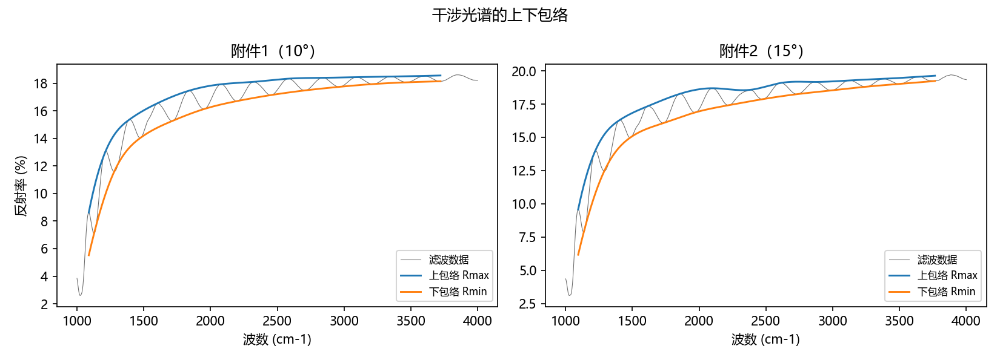

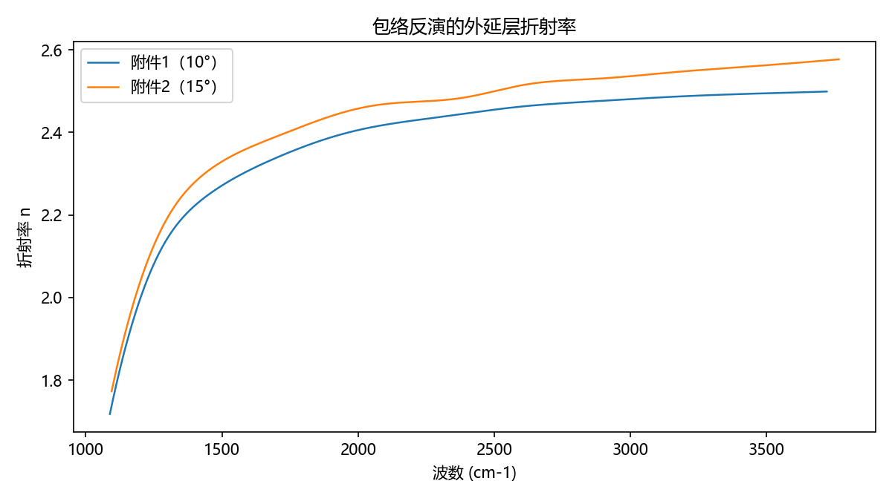

**计算结果**：附件 1、附件 2 在 1500、1750、2000、2250、2500、2750、3000、3250、3500 cm⁻¹ 处的外延层折射率 $n$ 与衬底折射率 $n_s$ 见下表。

| 波数（cm⁻¹） | 1500 | 1750 | 2000 | 2250 | 2500 | 2750 | 3000 | 3250 | 3500 |
| :--- | :---: | :---: | :---: | :---: | :---: | :---: | :---: | :---: | :---: |
| 附件 1 外延层 $n$ | 2.27 | 2.35 | 2.41 | 2.43 | 2.46 | 2.47 | 2.48 | 2.49 | 2.49 |
| 附件 1 衬底 $n_s$ | 2.21 | 2.29 | 2.35 | 2.39 | 2.42 | 2.44 | 2.46 | 2.47 | 2.48 |
| 附件 2 外延层 $n$ | 2.33 | 2.40 | 2.46 | 2.48 | 2.50 | 2.53 | 2.54 | 2.55 | 2.56 |
| 附件 2 衬底 $n_s$ | 2.27 | 2.34 | 2.40 | 2.44 | 2.47 | 2.49 | 2.51 | 2.53 | 2.55 |

### 3.6 外延层厚度的计算

在 2000–3800 cm⁻¹ 稳定区间内，将全部波峰、波谷按波数排序。任意两个极值点 $i<j$ 之间的条纹间隔数为

$$N=\frac{j-i}{2}, \tag{26}$$

即波峰—波峰、波谷—波谷为整数 $N$，波峰—波谷为半整数 $N$。为减少计算误差，**不考虑 $N=0.5$（相邻峰谷）的组合**，对其余全部组合，按问题 1 的式 (11)（重列如下）：

$$d=\frac{N}{2\left[\omega_j\sqrt{n^2(\omega_j)-n_0^2\sin^2\theta_1}-
\omega_i\sqrt{n^2(\omega_i)-n_0^2\sin^2\theta_1}\right]},$$

计算该组合对应的厚度估计值。其中 $n(\omega_i)$、$n(\omega_j)$ 由 3.5 节反演的折射率曲线在对应波数处取值，$\theta_1$ 取各自附件的实际入射角。

对全部组合的厚度估计值作统计，以**均值与标准差**作为最终结果。附件 1 的部分组合计算结果见下表（完整结果见 results 目录）。

| 波数 1（cm⁻¹） | 类型 | 折射率 1 | 波数 2（cm⁻¹） | 类型 | 折射率 2 | 条纹间隔数 N | 厚度（μm） |
| :---: | :---: | :---: | :---: | :---: | :---: | :---: | :---: |
| 2079.28 | 波峰 | 2.416 | 2325.73 | 波峰 | 2.439 | 1.0 | 7.71 |
| 2079.28 | 波峰 | 2.416 | 2449.94 | 波谷 | 2.451 | 1.5 | 7.67 |
| 2079.28 | 波峰 | 2.416 | 2584.14 | 波峰 | 2.462 | 2.0 | 7.50 |
| 2079.28 | 波峰 | 2.416 | 2704.61 | 波谷 | 2.468 | 2.5 | 7.58 |
| 2197.52 | 波谷 | 2.428 | 2449.94 | 波谷 | 2.451 | 1.0 | 7.50 |
| 2197.52 | 波谷 | 2.428 | 2584.14 | 波峰 | 2.462 | 1.5 | 7.33 |
| 2197.52 | 波谷 | 2.428 | 2704.61 | 波谷 | 2.468 | 2.0 | 7.48 |
| 2325.73 | 波峰 | 2.439 | 2584.14 | 波峰 | 2.462 | 1.0 | 7.29 |
| 2325.73 | 波峰 | 2.439 | 2704.61 | 波谷 | 2.468 | 1.5 | 7.50 |
| 2449.94 | 波谷 | 2.451 | 2704.61 | 波谷 | 2.468 | 1.0 | 7.45 |

**最终计算结果**：

| 附件 | 入射角 | 厚度均值（μm） | 标准差（μm） |
| :--- | :---: | :---: | :---: |
| 附件 1 | 10° | **7.564** | **0.1135** |
| 附件 2 | 15° | **7.214** | **0.2000** |

### 3.7 可靠性分析

可靠性分析采用两种方式：

1. **理论光谱对比**：取厚度估计值 $d$（如 $d=7.5\,\mu\text{m}$ 或最终均值），由式 (1) 计算光程差 $\Delta(\omega)$（折射率 $n(\omega)$ 取反演值），构造理论干涉光谱

$$r_{\text{the}}(\omega)=\frac{r_{\min}(\omega)+r_{\max}(\omega)}{2}
+\bigl(r_{\max}(\omega)-r_{\min}(\omega)\bigr)
\left[\cos^2\bigl(\Delta\pi\omega+\delta\varphi\bigr)-\frac12\right], \tag{27}$$

其中 $r_{\min}(\omega)$、$r_{\max}(\omega)$ 为实测数据包络，$\delta\varphi$ 为调整曲线位置的相位参数（按最小二乘拟合，附件 1 为 1.3283、附件 2 为 1.8289）。将理论光谱与实测光谱对比（图 6）：两者在 2000–3800 cm⁻¹ 内高度重合，均方根误差仅为 0.028%（附件 1）与 0.043%（附件 2）（反射率百分点），说明模型与厚度结果可靠。

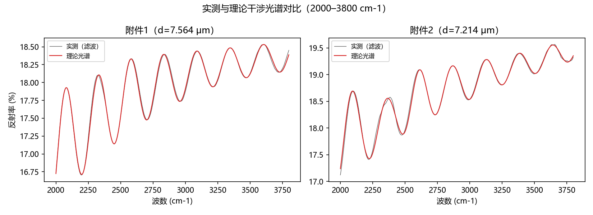

2. **两种口径对照**：分别用“仅波峰坐标”和“波峰+波谷坐标”计算厚度，结果见下表。两种口径结果相近（附件 1 相差 0.032 μm、附件 2 相差 0.006 μm），可作为可靠性的证据。

| 附件 | 口径 | 组合数 | 厚度均值（μm） | 标准差（μm） |
| :--- | :--- | :---: | :---: | :---: |
| 附件 1 | 波峰 + 波谷 | 78 | 7.564 | 0.1135 |
| 附件 1 | 仅波峰 | 21 | 7.532 | 0.0896 |
| 附件 2 | 波峰 + 波谷 | 78 | 7.214 | 0.2000 |
| 附件 2 | 仅波峰 | 21 | 7.220 | 0.2371 |

**可靠性结论**：① 理论光谱与实测光谱高度吻合（RMSE < 0.05%），说明由反演折射率和厚度重构的干涉光谱能很好地复现实测数据；② 两种独立口径（仅波峰、波峰+波谷）得到的厚度均值相差小于 0.04 μm，说明结果不依赖于峰谷选择方式；③ 附件 1 与附件 2 是同一块晶圆片在 10°、15° 两种入射角下的测试结果，两种口径下厚度均值均约 7.2–7.6 μm，一致性良好。综上，碳化硅外延层厚度计算结果可靠。

---

---

## 四、问题 3：多光束干涉与硅外延层厚度

问题 3 的求解分为四部分：① 推导多光束干涉的必要条件及其对厚度计算精度的影响；② 建立多光束干涉的数学模型；③ 判断附件 3、4（硅）是否出现多光束干涉并计算硅外延层厚度；④ 复核附件 1、2（碳化硅）是否受多光束干涉影响，若受影响则给出消除影响后的结果。

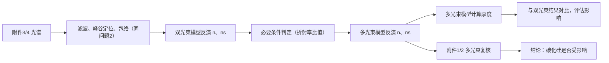

### 4.1 多光束干涉的必要条件

考虑光线在外延层内多次反射的情形（问题题目图 2）：$I_1$ 只经过一次反射（空气—外延层界面）；$I_2$ 经空气—外延层透射、外延层—衬底反射、外延层—空气再透射；$I_3$ 经透射后在外延层内反射 3 次（2 次外延层—衬底界面、1 次外延层—空气界面）再透射；$I_4$ 及以后各束光中间的反射次数按级数增加。各束光的光强为

$$I_1=r_{01},\qquad I_2=t_{01}r_{1s}t_{10}, \tag{28}$$

$$I_3=t_{01}r_{1s}^{2}r_{10}t_{10},\qquad
I_4=t_{01}r_{1s}^{3}r_{10}^{2}t_{10}. \tag{29}$$

由式 (28)、(29) 可知，出现明显多次反射的必要条件是：**至少 $I_3$ 不能过小**，即外延层—衬底界面反射率 $r_{1s}$ 要足够大。由式 (16)（问题 1），$r_{1s}=((n_s-n)/(n_s+n))^2$，因此 $r_{1s}$ 较大等价于外延层与衬底折射率之比足够大。可给出定量判据

$$\frac{n_s}{n}\ge 3 \quad \text{或} \quad \frac{n}{n_s}\ge 3. \tag{30}$$

例如，取 $n_0=1$、$n=4$、$n_s=4/3$（比值恰为 3），则 $r_{10}=r_{01}=0.36$，$t_{10}=t_{01}=0.64$，$r_{1s}=0.25$，$I_1=0.36$，$I_2=0.1024$，$I_3=0.009216$，$I_4=0.00082944$——$I_3$ 约占 $I_2$ 的 9%，已不可忽略；折射率比值越大，$I_3$、$I_4$ 越显著。

需要说明的是，通常光学中“光干涉”的三个一般条件（光矢量存在平行分量、频率相同、相位差恒定）在此问题中并不足以判断多光束干涉是否显著；**多光束干涉的必要条件应针对界面反射率（折射率比值）给出**。

多次反射对干涉光谱的影响：多次反射不改变波峰的坐标（位置），但会改变波谷的坐标与深度；此外波峰数值大于波谷，同等噪声下波峰信噪比更高。因此，**若存在多光束干涉，用波峰坐标计算厚度比用波谷坐标更可靠**。

### 4.2 多光束干涉的数学模型

多光束干涉在物理上永远存在，其总光强是各束反射光的相干叠加，可写成收敛级数并求和：

$$I=\frac{I_1+I_2+2\sqrt{I_1I_2}\cos\delta}{1+I_1I_2+2\sqrt{I_1I_2}\cos\delta}, \tag{31}$$

其中分母反映多次反射的累积效应。当分母中的多次反射项可忽略时，式 (31) 退化为双光束模型式 (4)。

由式 (31)，干涉光谱的最大、最小值变为

$$R_{\max}=\frac{I_1+I_2+2\sqrt{I_1I_2}}{1+I_1I_2+2\sqrt{I_1I_2}}
=\left(\frac{\sqrt{I_1}+\sqrt{I_2}}{1+\sqrt{I_1I_2}}\right)^2, \tag{32}$$

$$R_{\min}=\frac{I_1+I_2-2\sqrt{I_1I_2}}{1+I_1I_2-2\sqrt{I_1I_2}}
=\left(\frac{\sqrt{I_1}-\sqrt{I_2}}{1-\sqrt{I_1I_2}}\right)^2. \tag{33}$$

记 $A=\sqrt{I_1}$，$B=\sqrt{I_2}$，$C=\sqrt{R_{\max}}$，$D=\sqrt{R_{\min}}$，则

$$C=\frac{A+B}{1+AB},\qquad D=\frac{A-B}{1-AB}. \tag{34}$$

这是关于 $A$、$B$ 的二元二次方程组，共有 4 组根，其中 2 组根大于 1（无物理意义）舍去，保留

$$A=\frac{1+CD-\sqrt{(1-C^2)(1-D^2)}}{C+D}, \tag{35}$$

$$B=\frac{1-CD-\sqrt{(1-C^2)(1-D^2)}}{C-D}. \tag{36}$$

得到 $A$、$B$ 后，外延层与衬底折射率的计算公式与问题 1 相同（式 (23)、(24)）：

$$n=\frac{1+A}{1-A},\qquad n_s=\frac{n\left(1-A^2-B\right)}{1-A^2+B}.$$

### 4.3 附件 3、4 是否存在多光束干涉的判定

判定依据与 4.1 节必要条件保持一致：

1. **数据特征**：附件 3、4 在低波数段（约 500–1500 cm⁻¹）反射率的峰谷变化很大（附件 3 在该段反射率从约 0.1% 变化到 80%），说明外延层与衬底折射率之比很大，光线有可能在外延层内部产生多次反射；
2. **定量判据**：用数据包络反演得到硅外延层与衬底的折射率，计算折射率比值并与式 (30) 的量级对照：附件 3 在 500–1500 cm⁻¹ 内最大比值约 2.66（位于 747 cm⁻¹），附件 4 约 2.97（位于 752 cm⁻¹），已接近阈值 3 的量级；而碳化硅数据反演的比值仅约 1.1。
3. **峰谷变化幅度**：附件 3、4 在 500–1500 cm⁻¹ 内原始光谱峰谷差达 70.8% 与 78.4%（包络峰谷差 68.1% 与 75.6%），远大于碳化硅数据（约 2%），表明硅外延层与衬底的折射率对比度显著更高。

综合以上证据，**附件 3、4（硅）出现明显的多光束干涉**；碳化硅数据峰谷差小、折射率比值接近 1，未出现明显的多光束干涉（碳化硅复核见 4.5 节）。

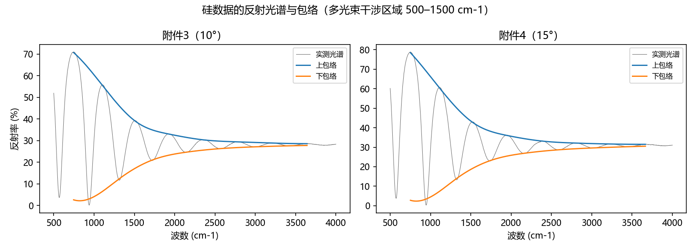

### 4.4 硅外延层厚度的计算

计算方法与问题 2 相同（101 点中心移动平均 → 三次样条插值 → 峰谷定位 → 包络反演 → 全组合式 (11) 计算厚度），但反射率模型分别采用双光束模型（式 (22)–(24)）与多光束模型（式 (35)–(36)）反演折射率，以便评估多光束干涉的影响。为使低波数极值点不被外推，包络构造覆盖 $\omega\ge 500$ cm⁻¹；厚度计算使用 1000–3800 cm⁻¹ 内的 13 个峰谷极值点，共 66 组组合（排除 $N=0.5$）。

**双光束模型反演的硅外延层折射率**：

| 波数（cm⁻¹） | 1500 | 1750 | 2000 | 2250 | 2500 | 2750 | 3000 | 3250 | 3500 |
| :--- | :---: | :---: | :---: | :---: | :---: | :---: | :---: | :---: | :---: |
| 附件 3 | 3.16 | 3.21 | 3.24 | 3.24 | 3.24 | 3.25 | 3.26 | 3.26 | 3.26 |
| 附件 4 | 3.40 | 3.44 | 3.47 | 3.47 | 3.47 | 3.48 | 3.49 | 3.49 | 3.50 |

**多光束模型反演的硅外延层折射率**：

| 波数（cm⁻¹） | 1500 | 1750 | 2000 | 2250 | 2500 | 2750 | 3000 | 3250 | 3500 |
| :--- | :---: | :---: | :---: | :---: | :---: | :---: | :---: | :---: | :---: |
| 附件 3 | 3.23 | 3.24 | 3.25 | 3.24 | 3.24 | 3.25 | 3.26 | 3.26 | 3.26 |
| 附件 4 | 3.50 | 3.48 | 3.49 | 3.47 | 3.47 | 3.48 | 3.49 | 3.50 | 3.50 |

两种模型的折射率差别主要出现在低波数段（附件 3 在 1105 cm⁻¹ 处由 3.00 变为 3.39），1500 cm⁻¹ 以上差别很小（图 8）。

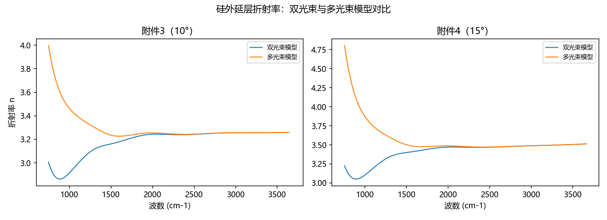

附件 3 的部分厚度组合计算结果（双光束模型）见下表，完整结果见 results 目录。

| 波数 1（cm⁻¹） | 类型 | 折射率 1 | 波数 2（cm⁻¹） | 类型 | 折射率 2 | 条纹间隔数 N | 厚度（μm） |
| :---: | :---: | :---: | :---: | :---: | :---: | :---: | :---: |
| 1105.28 | 波峰 | 2.997 | 1508.72 | 波峰 | 3.162 | 1.0 | 3.43 |
| 1105.28 | 波峰 | 2.997 | 1722.74 | 波谷 | 3.206 | 1.5 | 3.40 |
| 1314.48 | 波谷 | 3.122 | 1722.74 | 波谷 | 3.206 | 1.0 | 3.53 |
| 1105.28 | 波峰 | 2.997 | 1928.44 | 波峰 | 3.239 | 2.0 | 3.41 |
| 1314.48 | 波谷 | 3.122 | 1928.44 | 波峰 | 3.239 | 1.5 | 3.50 |
| 1508.72 | 波峰 | 3.162 | 1928.44 | 波峰 | 3.239 | 1.0 | 3.39 |
| 1105.28 | 波峰 | 2.997 | 2141.97 | 波谷 | 3.242 | 2.5 | 3.45 |
| 1314.48 | 波谷 | 3.122 | 2141.97 | 波谷 | 3.242 | 2.0 | 3.52 |
| 1508.72 | 波峰 | 3.162 | 2141.97 | 波谷 | 3.242 | 1.5 | 3.45 |
| 1722.74 | 波谷 | 3.206 | 2141.97 | 波谷 | 3.242 | 1.0 | 3.52 |

**硅外延层厚度计算结果**：

| 附件 | 入射角 | 模型 | 厚度均值（μm） | 标准差（μm） |
| :--- | :---: | :--- | :---: | :---: |
| 附件 3 | 10° | 双光束 | 3.531 | 0.0453 |
| 附件 3 | 10° | 多光束 | **3.661** | **0.1572** |
| 附件 4 | 15° | 双光束 | 3.262 | 0.0509 |
| 附件 4 | 15° | 多光束 | **3.413** | **0.1962** |

双光束与多光束模型的厚度均值绝对差：附件 3 为 0.130 μm，附件 4 为 0.151 μm，说明**多光束干涉对硅外延层厚度计算确有影响，必须采用多光束模型**。多光束模型下理论光谱与实测对比见图 9（1500–3800 cm⁻¹ 内均方根误差 0.19% 与 0.22% 反射率百分点）。

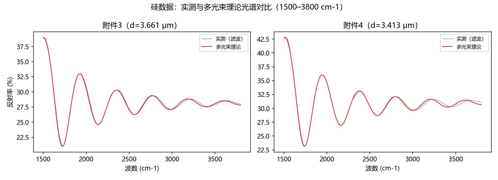

由于已判定硅数据存在多光束干涉，**硅外延层厚度以多光束模型的计算结果为准**（前后口径一致）。仅波峰口径的对照结果为：附件 3 双光束 3.519±0.0557、多光束 3.677±0.2051；附件 4 双光束 3.244±0.0613、多光束 3.430±0.2531，与峰+谷口径一致。

### 4.5 碳化硅数据的复核

为回答“多光束干涉是否也出现在附件 1、2 中”，按多光束模型重新反演附件 1、2 的折射率并计算厚度（方法与问题 2 相同，仅替换反射率模型）。若折射率与厚度相对问题 2 的双光束结果基本不变，则说明碳化硅数据不受多光束干涉影响，厚度无需修正（若受影响，则以多光束模型结果作为消除影响后的结果）。

**复核结果**：

| 附件 | 双光束模型 | 多光束模型 | 结论 |
| :--- | :--- | :--- | :--- |
| 附件 1 | 7.564 ± 0.1135（问题 2） | 7.564 ± 0.1134 | 基本不受影响（均值差 0.0007 μm） |
| 附件 2 | 7.214 ± 0.2000（问题 2） | 7.215 ± 0.2000 | 基本不受影响（均值差 0.0006 μm） |

多光束模型下附件 1、2 的折射率与双光束模型逐位相同（1500–3500 cm⁻¹ 内均为 2.27–2.49 与 2.33–2.56），厚度均值变化小于 0.001 μm，多光束理论光谱与实测的均方根误差仅 0.03% 与 0.04%（图 10、图 11）。因此，**碳化硅数据不受多光束干涉影响，问题 2 的厚度结果无需修正**（若按“消除影响”处理，结果与问题 2 相同）。

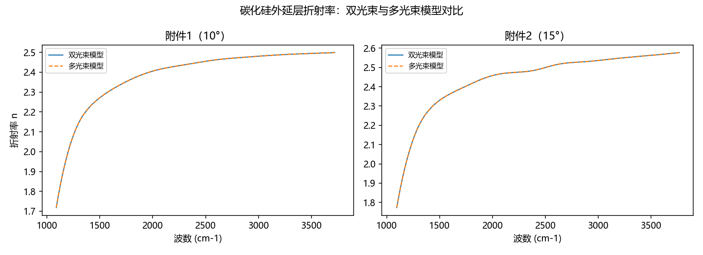

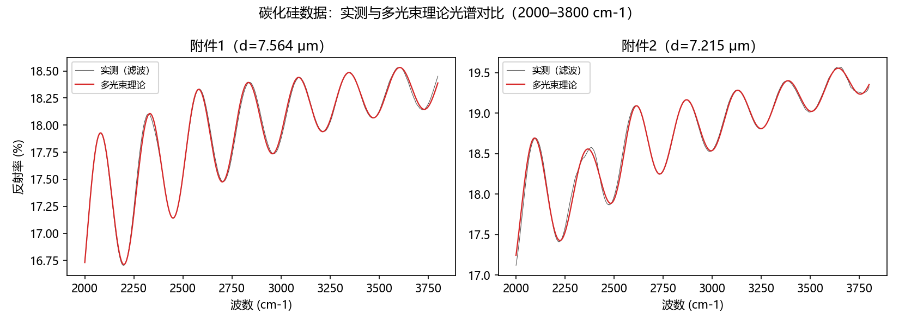

### 4.6 最终结果

将同一晶圆片的两个附件（不同入射角）的结果按**逆方差加权**（$w=1/\sigma^2$）合并，并用正态近似给出 95% 置信区间：

$$\bar{d}=\frac{\sum w_k d_k}{\sum w_k},\qquad
\mathrm{SE}=\sqrt{\frac{1}{\sum w_k}},\qquad
\bar{d}\pm 1.96\,\mathrm{SE}.$$

| 材料 | 最终厚度（μm） | 95% 置信区间（μm） |
| :--- | :---: | :---: |
| 碳化硅（附件 1、2，多光束复核值） | **7.479** | **[7.286, 7.672]** |
| 硅（附件 3、4，多光束模型值） | **3.564** | **[3.324, 3.805]** |

---

## 参考文献

[1] 全国大学生数学建模竞赛组委会. 2025 年“高教社杯”全国大学生数学建模竞赛赛题[EB/OL]. (2025-09-04). https://www.mcm.edu.cn/html_cn/node/03c9a444e62eee8a3740fa97a461a6.html.

[2] 游璞, 于国萍. 光学[M]. 北京: 高等教育出版社, 2003.

[3] 薛毅, 陈立萍. 时间序列分析与 R 软件[M]. 北京: 清华大学出版社, 2020.

[4] 薛毅. 数学建模基于 R[M]. 北京: 机械工业出版社, 2017.

[5] Tang X, Zhang Y, Li Z, et al. Thickness determination of 4H-SiC epitaxial films by infrared reflectance[C]//2009 IEEE International Conference of Electron Devices and Solid-State Circuits (EDSSC). IEEE, 2009: 295-297.

[6] MacMillan M F, Henry A, Janzén E. Thickness determination of low doped SiC epi-films on highly doped SiC substrates[J]. Journal of Electronic Materials, 1998, 27(4): 300-303.

[7] Wang S, Zhan M, Wang G, et al. 4H-SiC: a new nonlinear material for midinfrared lasers[J]. Laser & Photonics Reviews, 2013, 7(5): 831-838.
